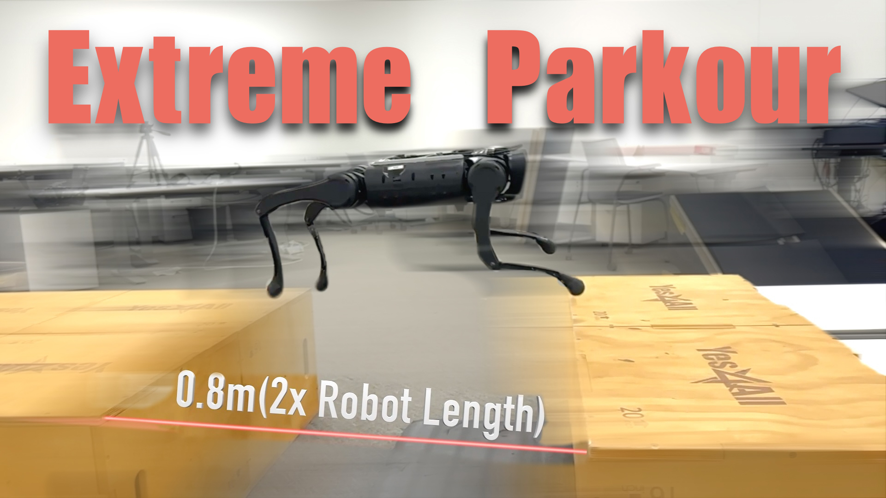

# Extreme Parkour with Legged Robots #
<p align="center">

</p>

**Authors**: [Xuxin Cheng*](https://chengxuxin.github.io/), [Kexin Shi*](https://tenhearts.github.io/), [Ananye Agarwal](https://anag.me/), [Deepak Pathak](https://www.cs.cmu.edu/~dpathak/)  
**Website**: https://extreme-parkour.github.io  
**Paper**: https://arxiv.org/abs/2309.14341  
**Tweet Summary**: https://twitter.com/pathak2206/status/1706696237703901439

### Installation ###
```bash
conda create -n parkour python=3.8
conda activate parkour
cd
pip3 install torch==1.10.0+cu113 torchvision==0.11.1+cu113 torchaudio==0.10.0+cu113 -f https://download.pytorch.org/whl/cu113/torch_stable.html
git clone git@github.com:chengxuxin/extreme-parkour.git
cd extreme-parkour
# Download the Isaac Gym binaries from https://developer.nvidia.com/isaac-gym 
# Originally trained with Preview3, but haven't seen bugs using Preview4.
cd isaacgym/python && pip install -e .
cd ~/extreme-parkour/rsl_rl && pip install -e .
cd ~/extreme-parkour/legged_gym && pip install -e .
pip install "numpy<1.24" pydelatin wandb tqdm opencv-python ipdb pyfqmr flask
```

### Usage ###
`cd legged_gym/scripts`
1. Train base policy:  
```bash
python train.py --exptid xxx-xx-WHATEVER --device cuda:0
```
Train 10-15k iterations (8-10 hours on 3090) (at least 15k recommended).

2. Train distillation policy:
```bash
python train.py --exptid yyy-yy-WHATEVER --device cuda:0 --resume --resumeid xxx-xx --delay --use_camera
```
Train 5-10k iterations (5-10 hours on 3090) (at least 5k recommended). 
>You can run either base or distillation policy at arbitary gpu # as long as you set `--device cuda:#`, no need to set `CUDA_VISIBLE_DEVICES`.

3. Play base policy:
```bash
python play.py --exptid xxx-xx
```
No need to write the full exptid. The parser will auto match runs with first 6 strings (xxx-xx). So better make sure you don't reuse xxx-xx. Delay is added after 8k iters. If you want to play after 8k, add `--delay`

4. Play distillation policy:
```bash
python play.py --exptid yyy-yy --delay --use_camera
```

5. Save models for deployment:
```bash
python save_jit.py --exptid xxx-xx
```
This will save the models in `legged_gym/logs/parkour_new/xxx-xx/traced/`.

### Current Branch: Auxiliary Proprio Prediction ###
This branch adds an auxiliary proprioception prediction head to the base policy. The head takes the policy-side observation features and the executed action as input, then predicts the robot proprioception for the next step. The prediction loss is added to PPO training on valid parkour terrains.

The auxiliary head is used in two phases:
- Before `next_proprio_aux_stop_iter` iterations, `use_next_proprio_aux_loss` controls the auxiliary supervision loss.
- After `next_proprio_aux_stop_iter` iterations, `use_post_next_proprio_sup_loss` keeps supervising the same head while the policy can use the predicted next proprioception to compensate action delay.

The head can be trained in either of two modes:
- Full next-proprio mode, the default: the head predicts `proprio[t + 1]`.
- Residual mode: the head predicts `proprio[t + 1] - proprio[t]`.

Residual mode is enabled only by the training CLI flag:
```bash
python train.py \
  --exptid xxx-xx-prio-res \
  --device cuda:0 \
  --predict_next_proprio_residual true
```

In full next-proprio mode, the post-delay predictor forms the imagined proprioception as:
```text
(1 - alpha) * proprio[t] + alpha * predicted_proprio[t + 1]
```

In residual mode, it forms the imagined proprioception as:
```text
proprio[t] + alpha * predicted_residual
```

`alpha` starts at `post_delay_predictor_alpha_start`, ramps to `post_delay_predictor_alpha_end`, and starts being used after `post_delay_predictor_start_iter`.

Example base-policy training commands:
```bash
# Default: predict the full next proprioception.
python train.py --exptid 001-00-full-prio --device cuda:0

# Residual: predict next-current proprioception residual.
python train.py --exptid 001-01-res-prio --device cuda:0 --predict_next_proprio_residual true

# Disable the pre-threshold auxiliary loss.
python train.py --exptid 001-02-no-pre-aux --device cuda:0 --use_aux_proprio_loss false

# Change auxiliary head size and delay predictor start iteration.
python train.py \
  --exptid 001-03-large-head \
  --device cuda:0 \
  --next_proprio_head_dims large \
  --post_delay_predictor_start_iter 6000
```

### Viewer Usage
Can be used in both IsaacGym and web viewer.
- `ALT + Mouse Left + Drag Mouse`: move view.
- `[ ]`: switch to next/prev robot.
- `Space`: pause/unpause.
- `F`: switch between free camera and following camera.

### Arguments
- --exptid: string, can be `xxx-xx-WHATEVER`, `xxx-xx` is typically numbers only. `WHATEVER` is the description of the run. 
- --device: can be `cuda:0`, `cpu`, etc.
- --delay: whether add delay or not.
- --checkpoint: the specific checkpoint you want to load. If not specified load the latest one.
- --resume: resume from another checkpoint, used together with `--resumeid`.
- --seed: random seed.
- --no_wandb: no wandb logging.
- --use_camera: use camera or scandots.
- --web: used for playing on headless machines. It will forward a port with vscode and you can visualize seemlessly in vscode with your idle gpu or cpu. [Live Preview](https://marketplace.visualstudio.com/items?itemName=ms-vscode.live-server) vscode extension required, otherwise you can view it in any browser.
- --use_aux_proprio_loss: boolean, default `true`. Enables the pre-threshold auxiliary next-proprio loss.
- --predict_next_proprio_residual: boolean, default config value is `false`. When `true`, trains and uses the head as a next-current proprio residual predictor. When `false`, trains and uses it as a full next-proprio predictor.
- --next_proprio_head_dims: hidden dimensions for the auxiliary prediction head. Presets are `small` (`128,64`), `medium` (`256,128`), and `large` (`256,128,64`); explicit comma-separated dimensions like `256,128` are also accepted.
- --post_delay_predictor_start_iter: iteration when the post-delay predictor starts affecting policy inference and when post-threshold supervision begins by default. The base config default is `8000`.
- --max_iterations: maximum PPO training iterations. The base config default is used when omitted.
- --num_envs: number of parallel Isaac Gym environments.
- --rows / --cols: terrain curriculum grid size overrides.
- --debug: disables wandb logging and uses a small debug setup.

### Acknowledgement
https://github.com/leggedrobotics/legged_gym  
https://github.com/Toni-SM/skrl

### Citation
If you found any part of this code useful, please consider citing:
```
@article{cheng2023parkour,
title={Extreme Parkour with Legged Robots},
author={Cheng, Xuxin and Shi, Kexin and Agarwal, Ananye and Pathak, Deepak},
journal={arXiv preprint arXiv:2309.14341},
year={2023}
}
```
